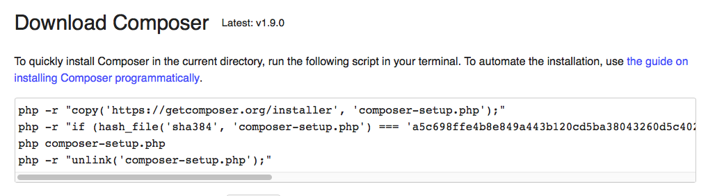
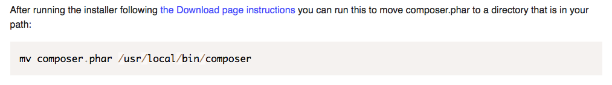

# symphart

An introduction to Sympfony 4.

## Baby steps for development:

Install Composer (globally)

Check with command: `composer -V`.

Then navigate to directory "/Applications/XAMPP/xamppfiles/htdocs/sites" (or your public web server directory) and create a new Symfony proyect with this command: `composer create-project symfony/skeleton symphart`.

Start your web server (Apache) and load in your browser this URL: `http://localhost/sites/symphart/public/`

> **NOTE:** I created this project inside a folder called "sites" but you can skip that folder if you prefer create a virtual host.

## Resources:
* [Symfony docs](https://symfony.com/doc)
* [Composer docs](https://symfony.com/doc)